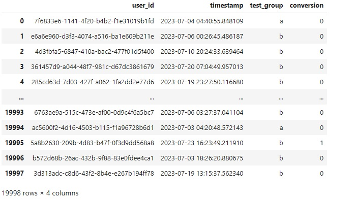
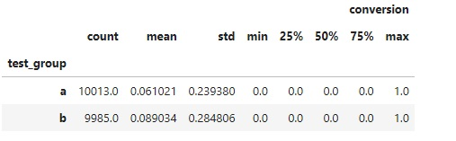
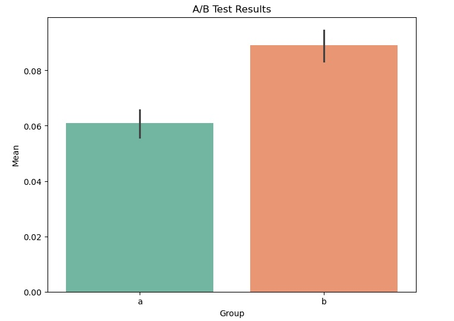
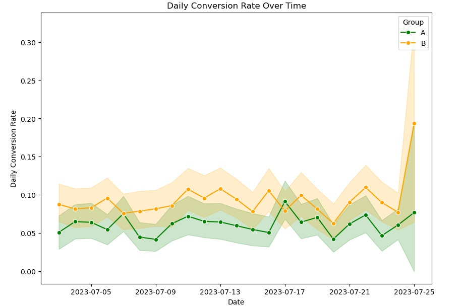

# A/B Test Results Evaluation

## Project Overview

This project aims to evaluate the results of an A/B test. The goal is to determine whether offering a discount significantly affects the conversion rate of users who install the application and subsequently purchase a subscription.

### A/B Test Details

- **Group A**: Users are offered a subscription for $4.99 to access premium features of the app.
- **Group B**: Users are offered the same subscription, but with an added note that this is a 50% discounted price.

To simplify, we assume that other metrics (such as engagement or retention) have not changed significantly, so we will focus our analysis solely on conversion from install to payment.

## Steps to Complete the Task

### 1. Load and Explore Data

- The data is loaded from the `ab_test_data.csv` file.
- The following information is extracted and displayed:
  - The number of users in groups A and B.
  - The number of conversions in groups A and B.
  - The conversion rate in groups A and B.
  - The start and end date of the A/B test, and the duration of the test in days.

### 2. Statistical Hypothesis Testing

- A statistical test is chosen to test the hypotheses.
  - **Null Hypothesis (H₀)**: There is no significant difference in the conversion rates between Group A and Group B.
  - **Alternative Hypothesis (H₁)**: There is a significant difference in the conversion rates between Group A and Group B.
- The test statistic and p-value are calculated to determine if the null hypothesis can be rejected.

### 3. Visualization of Conversion Rates

- A bar chart is created comparing the average conversion rates between the two groups with 95% confidence intervals.

### 4. Conclusion

- Based on the statistical analysis and visualizations, a conclusion is made on whether the change in conversion rates is statistically significant.

### 5. Conversion Rate Over Time

- A time series graph is created to show the change in conversion rates over time.

## How to Run the Project

Ensure you have Python installed and the following libraries:

- pandas
- numpy
- matplotlib
- seaborn
- scipy